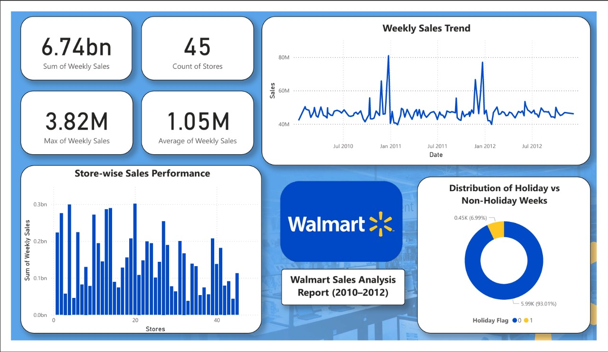

# 📦 Walmart Sales Forecasting  

---

## 📖 Overview  
This project analyzes and forecasts **weekly sales data** across multiple Walmart stores to improve **inventory management** and **demand planning**.

---

## 🧠 Objectives  
- Perform exploratory data analysis (EDA) to identify trends, seasonality, and outliers  
- Understand how external factors like CPI, temperature, fuel price, and unemployment affect sales  
- Detect store-level performance differences  
- Build forecasting models (ARIMA, SARIMA, etc.) to predict sales for the next 12 weeks  

---

## 📊 Project Workflow  

### 1️⃣ Data Preprocessing  
- Handle missing values, incorrect data types, and outliers  

### 2️⃣ Exploratory Data Analysis  
- Investigate weekly sales trends  
- Study relationships with CPI, unemployment, holidays, and temperature  
- Identify top and bottom performing stores  

### 3️⃣ Feature Engineering  
- Create lag variables and time-based features (month, holiday flag, etc.)  

### 4️⃣ Forecasting  
- Use ARIMA/SARIMA for univariate forecasting per store  
- Forecast next 12 weeks of sales for each store  

### 5️⃣ Evaluation  
- Evaluate model performance using RMSE  

---

## 👤 Author  
**Rehan Abdul Gani Shaikh**  
_Aspiring Data Scientist | B.Tech Student_  

🔗 **Connect with me:** [LinkedIn](https://www.linkedin.com/in/rehan-shaikh-68153a246)  
📬 **Email:** rehansk.3107@gmail.com  
